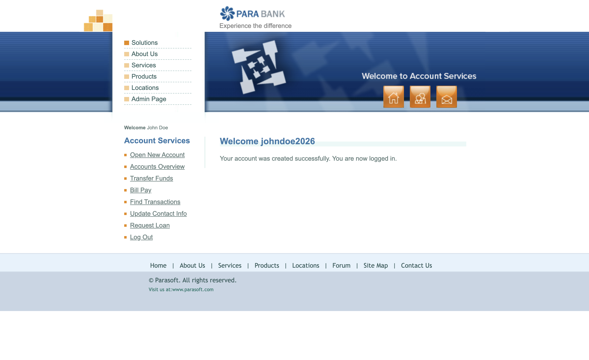
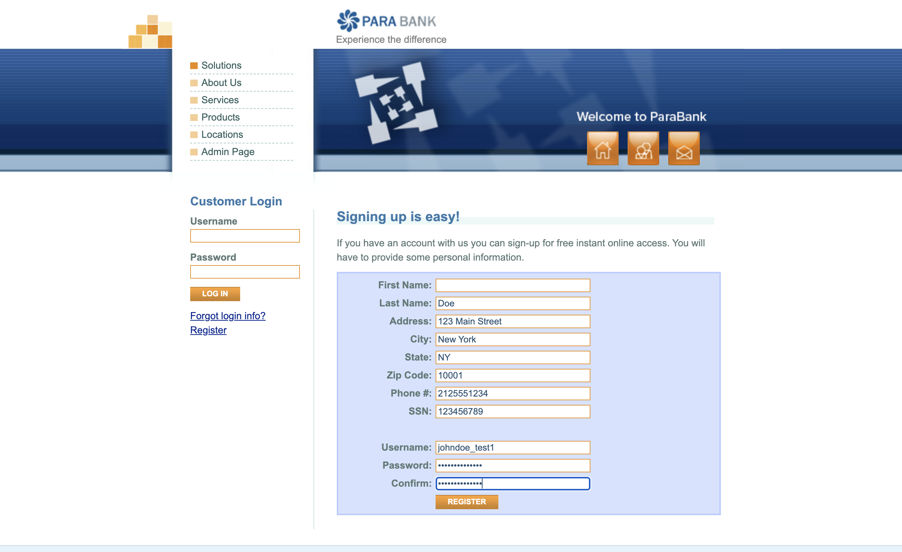
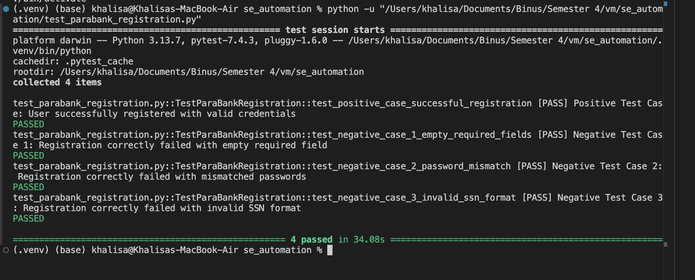

# ParaBank Registration — Test Automation

## Overview
This repository contains automated tests for the ParaBank registration flow using Selenium and pytest. Tests cover positive and negative scenarios and capture screenshots saved to `test_results/`.

## Members
1. **Christofle Tjhai** — NIM: 2802398914
2. **Khalisa Amanda Sifa Ghaizani** — NIM: 2802449455
3. **Clarissa Ken Alison** — NIM: 2802394014
4. **Joshua Tanusenjaya** — NIM: 2802455621
5. **Kenrick Willson** — NIM: 2802392002z

## Contributors & Roles
- **Christofle Tjhai**: Selenium WebDriver configuration, screenshot capture, and WebDriverManager integration.
- **Khalisa Amanda Sifa Ghaizani**: pytest configuration, test design, and CI/test run orchestration.
- **Clarissa Ken Alison**: Test data design, negative/edge-case scenarios, and form validation checks.
- **Joshua Tanusenjaya**: Test scripting, flow automation, and result verification assertions.
- **Kenrick Willson**: Test reporting, result artifact collection, and README/documentation updates.

## Requirements
- Python 3.7+
- Selenium
- pytest
- webdriver-manager

Install dependencies:
```bash
python -m venv venv
source venv/bin/activate
pip install -r requirements.txt
```

## Running Tests
Run all tests:
```bash
pytest test_parabank_registration.py -v -s
```

Run a single test:
```bash
pytest test_parabank_registration.py::TestParaBankRegistration::test_positive_case_successful_registration -q
```

## Test Cases
- Positive: successful registration with valid data.
- Negative: missing required fields (First Name), mismatched passwords, invalid SSN format.

## Test Results (screenshots)
Screenshots and result artifacts are saved in `test_results/`. Below are the captured images from recent test runs:

Positive case — before submit:


Positive case — result:


Negative case 1 — before submit (empty required field):


Negative case 1 — result (error shown):


Negative case 2 — before submit (password mismatch):


Negative case 2 — result (passwords did not match):


Negative case 3 — before submit (invalid SSN):


Negative case 3 — result (SSN validation error):




## Project Structure
```
se_automation/
├── test_parabank_registration.py
├── requirements.txt
├── README.md
└── test_results/
   ├── positive_case_before_submit.png
   ├── positive_case_result.png
   ├── negative_case_1_before_submit.png
   ├── negative_case_1_result.png
   ├── negative_case_2_before_submit.png
   ├── negative_case_2_result.png
   ├── negative_case_3_before_submit.png
   ├── negative_case_3_result.png
   └── test_cases.json
```

## Test Execution Flow
1. WebDriver setup (Chrome via webdriver-manager).
2. Navigate to the ParaBank registration page.
3. Fill registration form with test data.
4. Click `Register`.
5. Capture screenshot and save to `test_results/`.
6. Assert expected behaviour and generate test output.

## Notes
- Chrome WebDriver is managed automatically by `webdriver-manager`.
- Screenshots are stored in `test_results/` per test.
- Add new test cases to `test_parabank_registration.py` and update `test_results/test_cases.json`.

## Acknowledgements
This test suite was created and maintained by the QA Automation Team listed above.
